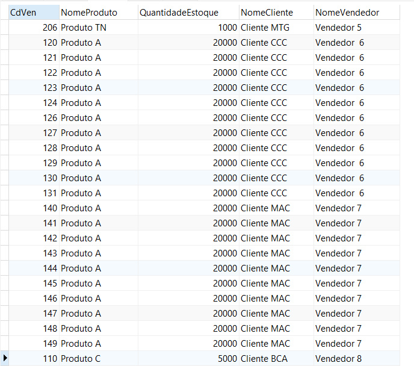
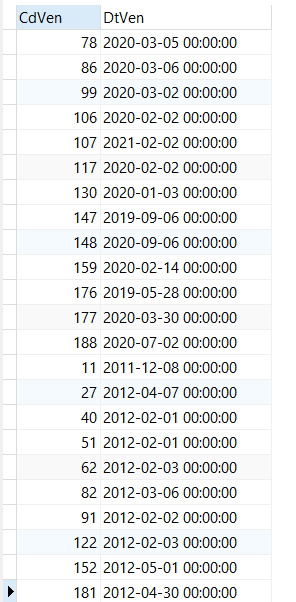

# Análise de Vendas

- **Empresa**: sales.z
- **Contato**: Alex Souza
- **Email**: aasouzaconsult@gmail.com

-----

- ***Consultoria***: data.z
- ***Entrega do projeto em***: 08.05.2022
- ***Responsável pela entrega***: Daniela Bragança
- ***Necessidade do cliente (resumo)***: Análise da base de vendas, com o objetivo de responder as perguntas realizadas pelo cliente.


## Consultas


## Fase 1:

### Quantidade de dependentes
```sql
SELECT count(*) AS QtdDependentes FROM TbDependente;
```

Resultado:


### Quantidade de dependentes por sexo
```sql
SELECT SxDep, count(*) AS QtdDependentes FROM TbDependente GROUP BY SxDep;
```

Resultado:


### Quantidade de clientes da região sul
```sql
SELECT count(*) QtdClientes FROM TbVendas WHERE Estado IN ('Santa Catarina', 'Rio Grande do Sul', 'Paraná');
```

Resultado (vendas totais):


```sql
SELECT count(DISTINCT CdCli) QtdClientes FROM TbVendas WHERE Estado IN ('Santa Catarina', 'Rio Grande do Sul', 'Paraná');
```
Resultado (clientes exclusivos):


### Uma descrição breve dos produtos da empresa (codigo, nome, tipo)
```sql
SELECT DISTINCT CdPro Codigo, NmPro Nome, TpPro Tipo FROM TbVendas;
```

Resultado:


### Quais os 5 produtos mais vendidos de 2021?
```sql
SELECT NmPro, COUNT(*) AS QtdVendas FROM TbVendas WHERE YEAR(DtVen)=2021 GROUP BY CdPro, NmPro ORDER BY COUNT(*) DESC LIMIT 5;
```

Resultado:


### Nome, Nome em Maiúsculo e Nome em Minúsculo, dos vendedores do sexo feminino
```sql
SELECT NmVdd Nome, LOWER(NmVdd) NomeMinusculo, UPPER(NmVdd) NomeMaiusculo FROM TbVendedor WHERE SxVdd=1;
```

Resultado:


### Nome e idade de todos os dependentes, ordenados do mais velho para o mais novo
```sql
SELECT NmDep AS Nome, TIMESTAMPDIFF(YEAR, DtNasc, NOW()) AS Idade FROM TbDependente ORDER BY TIMESTAMPDIFF(YEAR, DtNasc, NOW()) DESC;
```

Resultado:


### Somatório do Valor Total de Vendas (concluídas e não deletadas) por Estado
```sql
SELECT Estado, SUM(VrUnt*Qtd) AS Somatorio FROM TbVendas WHERE Status='Concluído' AND deletado=0 GROUP BY Estado;
```

Resultado:


### Somatório de Unidades Vendidas (concluídas e não deletadas) por Produto
```sql
SELECT NmPro, SUM(Qtd) AS UnidadesVendidas FROM TbVendas WHERE Status='Concluído' AND deletado=0 GROUP BY NmPro;
```

Resultado:


### Média do Valor Total de Vendas por Estado
```sql
SELECT Estado, AVG(VrUnt*Qtd) AS Media FROM TbVendas GROUP BY Estado;
```

Resultado:


### Nome dos clientes que compram o produto 1
```sql
SELECT DISTINCT NmCli Nome FROM TbVendas WHERE CdPro=1;
```

Resultado:


### Quantidade mínima e qual o respectivo produto
```sql
SELECT NmPro Produto, MIN(Qtd) QtdMinima FROM TbVendas GROUP BY NmPro;
```

Resultado:


### Uma descrição detalhada dos produtos da empresa (codigo, nome, tipo, Qtd em Estoque)
```sql
SELECT DISTINCT V.CdPro Codigo, V.NmPro Produto, V.TpPro Tipo, E.QtdPro QtdProduto 
FROM TbVendas V 
INNER JOIN TbEstoqueProduto E ON V.CdPro = E.CdPro;
```

Resultado:


### Nome dos Vendedores que realizaram determinadas Vendas (Codigo da Venda, Data da Venda, Produto e nome do vendedor)
```sql
SELECT V.CdVen Codigo, V.DtVen DataVenda, NmPro Produto, NmVdd Vendedor
FROM TbVendas V
INNER JOIN TbVendedor Ve ON V.CdVdd = Ve.CdVdd;
```

Resultado:


### Relação com o nome dos vendedores e seus respectivos filhos (dependentes - nome e data de nascimento) -- montar uma view com estes dados
```sql
CREATE VIEW VwVendedores AS
	SELECT NmVdd NomeVendedor, NmDep NomeDependente, DtNasc DataNascimento
	FROM TbVendedor Ve 
	INNER JOIN TbDependente D ON Ve.CdVdd = D.CdVdd;
	
SELECT * FROM VwVendedores;
```

Resultado:


### Criar uma view com informações de vendas, produto, estoque, cliente, vendedores (apenas concluídas e não deletadas)
```sql
CREATE VIEW VwVendas AS
	SELECT CdVen, NmPro NomeProduto, E.QtdPro QuantidadeEstoque, NmCli NomeCliente, Ve.NmVdd NomeVendedor
	FROM TbVendas V 
	INNER JOIN TbEstoqueProduto E ON V.CdPro = E.CdPro
	INNER JOIN TbVendedor Ve ON Ve.CdVdd = V.CdVdd
	WHERE V.Status='Concluído' AND V.deletado=0;
	
SELECT * FROM VwVendas
```

Resultado:





### View de quantidade de vendas por canal
```sql
CREATE VIEW VwCanal AS
	SELECT NmCanalVendas, COUNT(*) QtdVendas
	FROM TbVendas V 
	GROUP BY NmCanalVendas;
	
SELECT * FROM VwCanal;
```

Resultado:


## Fase 2:
### Filtrar a tabela de vendedores pelo vendedor de nome: Vendedor 6
```sql
SELECT * FROM TbVendedor WHERE NmVdd='Vendedor 6'
```
Resultado (não existe vendedor com o nome 'Vendedor 6' exatamente:


```sql
SELECT * FROM TbVendedor WHERE NmVdd='Vendedor  6  '
```

Resultado (ajustando a consulta para 'Vendedor  6  '):


### Uma consulta que retorno o nome dos dependentes, mas quando for o dependente de código 5, retorne o seu nome. (Usando IF ou CASE)
```sql
SELECT CASE WHEN CdDep=5 THEN 'Daniela' ELSE NmDep END AS NomeDependente 
FROM TbDependente
```

Resultado:


### Retornar todas as vendas entre os dias 07/05/2019 a 03/03/2021 unidas com as todas as vendas entre os dias 11/09/2011 a 03/09/2012
```sql
SELECT CdVen, DtVen 
FROM TbVendas V
WHERE DtVen BETWEEN '2019-05-17' AND '2021-03-03'
UNION
SELECT CdVen, DtVen 
FROM TbVendas V
WHERE DtVen BETWEEN '2011-09-11' AND '2012-09-03'
```

Resultado:




### Retornar o nome do produto (apenas os 5 primeiros caracteres) e a quantidade de venda com 10 dígitos, completando com zeros a esquerda.
```sql
SELECT SUBSTRING(NmPro, 1, 5) NomeProduto, LPAD(COUNT(*), 10, '0') AS QtdVendas
FROM TbVendas V
GROUP BY NmPro
```

Resultado:


### Qual o produto que tem a maior quantidade de vendas no canal: Ecommerce?
```sql
SELECT NmPro Produto, COUNT(*) QtdVendas
FROM TbVendas V
WHERE NmCanalVendas = 'Ecommerce'
ORDER BY COUNT(*) DESC LIMIT 1
```

Resultado:


### Existiram vendas para produtos em MVP - validação? Quais foram?
```sql
SELECT CdVen, NmPro NomeProduto, NmCli NomeCliente
FROM TbVendas V 
INNER JOIN TbEstoqueProduto E ON V.CdPro = E.CdPro
WHERE E.`Status` = 'MVP - validação'
```

Resultado:


### Quantas vendas encontram-se deletadas logicamente?
```sql
SELECT COUNT(*) QtdVendasDeletadas
FROM TbVendas V
WHERE deletado=1
```

Resultado:


### Quantas vendas encontram-se canceladas?
```sql
SELECT COUNT(*) QtdVendasCanceladas
FROM TbVendas V
WHERE Status='Cancelado'
```

Resultado:


### Na tabela de dependentes, temos o código da Escola que o dependente estuda, precisamos além do códido da escola (INEP), saber o nome da escola de cada um dos dependentes estudam. (planilha com nome da escola em anexo)

```sql
SELECT dep.NmDep Dependente, dep.InepEscola, escolas.Escola 
FROM TbDependente dep
JOIN Censo2020.TbEscolas escolas ON escolas.CODINEP = dep.InepEscola
```

Resultado :


```sql
SELECT dep.NmDep Dependente, dep.InepEscola, escolas.Escola 
FROM TbDependente dep
LEFT JOIN Censo2020.TbEscolas escolas ON escolas.CODINEP = dep.InepEscola
```

Resultado:


```sql
SELECT * FROM Censo2020.TbEscolas WHERE CODINEP IN (11019131, 11010860, 11018500, 11036680)
```
Resultado:


```sql
SELECT * FROM Censo2020.TbEscolas limit 10
```

Resultado:

